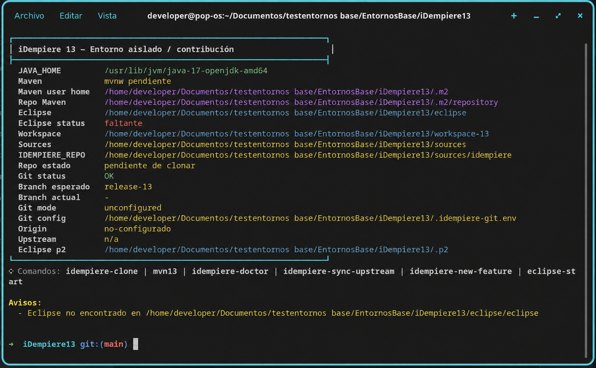

# Entornos aislados de desarrollo para iDempiere

[English version](README.md)

Este repositorio reúne configuraciones `direnv` para trabajar con varias versiones de iDempiere sin mezclar Java, Maven, repositorios de dependencias, instalaciones de Eclipse ni workspaces. Cada subdirectorio es un entorno independiente y su archivo `.envrc` es la fuente de verdad.



## Versiones disponibles

| Directorio | Rama de iDempiere | Java | Maven | Comando de build | Git asistido |
|---|---|---:|---|---|---|
| [`iDempiere8.2`](iDempiere8.2/README.es.md) | `release-8.2` | 11 | local 3.6.3 | `mvn82` | repositorio oficial |
| [`iDempiere10`](iDempiere10/README.es.md) | `release-10` | 11 | local 3.6.3 | `mvn10` | repositorio oficial |
| [`iDempiere12`](iDempiere12/README.es.md) | `release-12` | 17 | local 3.9.11 | `mvn12` | repositorio oficial |
| [`iDempiere13`](iDempiere13/README.es.md) | `release-13` | 17 | Maven Wrapper del proyecto | `mvn13` | oficial o fork |

Las versiones indicadas para Maven local son las distribuciones que espera cada `.envrc`. En la versión 13, la versión efectiva la determina `sources/idempiere/.mvn/wrapper/maven-wrapper.properties` una vez clonado el proyecto.

## Requisitos

- Linux o macOS y una shell compatible con Bash.
- `direnv`, integrado con la shell.
- Git; acceso de red para clonar y descargar dependencias.
- JDK 11 para iDempiere 8.2 y 10.
- JDK 17 para iDempiere 12 y 13.
- Eclipse instalado manualmente en el directorio `eclipse/` del entorno que se utilizará.
- Maven descomprimido manualmente en `apache-maven-3.6.3/` para 8.2 y 10, o en `apache-maven-3.9.11/` para 12.

El proyecto no instala Java, Maven ni Eclipse. Tampoco clona las fuentes durante `direnv allow`.

Configure una sola vez el hook de `direnv` correspondiente a su shell. Por ejemplo, para Zsh:

```sh
echo 'eval "$(direnv hook zsh)"' >> ~/.zshrc
exec zsh
```

## Puesta en marcha

Clone este repositorio y entre en él:

```sh
git clone git@github.com:Carl0gonzalez/idempiere-dev-environments.git
cd idempiere-dev-environments
```

Elija una versión y entre en su directorio. Por ejemplo:

```sh
cd iDempiere13
direnv allow
idempiere-doctor
idempiere-clone
direnv reload
mvn13 verify
eclipse-start
```

Para otra versión, cambie el directorio y el comando Maven según la tabla. En 8.2, 10 y 12, coloque antes la distribución Maven esperada en el directorio indicado. En Linux, instale Eclipse como `eclipse/eclipse`; en macOS, coloque `Eclipse.app` en `eclipse/Eclipse.app`.

`direnv allow` realiza tareas locales y repetibles:

- selecciona el JDK compatible;
- define las rutas del entorno;
- crea `.m2`, `.p2`, `.local-bin`, `sources` y el workspace;
- genera un `settings.xml` Maven local cuando falta;
- regenera los comandos auxiliares y los añade temporalmente a `PATH`.

No descarga componentes ni modifica una instalación Maven o Eclipse global.

## Distribución de cada entorno

```text
iDempiereXX/
├── .envrc                 configuración versionada
├── .gitignore             exclusiones locales de la versión
├── .local-bin/            comandos generados
├── .m2/                   configuración y repositorio Maven aislados
├── .p2/                   configuración P2 aislada
├── eclipse/               instalación local aportada por el usuario
├── sources/idempiere/     clon de las fuentes
└── workspace-XX/          workspace de Eclipse
```

Las carpetas generadas, las fuentes clonadas, las herramientas locales y la configuración Git privada están excluidas mediante `.gitignore`. Los archivos `.envrc` y los README sí deben conservarse en el repositorio.

## Comandos comunes

| Comando | Función |
|---|---|
| `idempiere-clone` | Clona la rama prevista en `sources/idempiere`; se niega a sobrescribir un destino no vacío. |
| `idempiere-root` | Abre una nueva shell situada en las fuentes de iDempiere. |
| `idempiere-doctor` | Comprueba Java, Maven, Git, Eclipse, rutas y metadatos disponibles. Devuelve un estado distinto de cero si detecta fallos. |
| `eclipse-start` | Inicia Eclipse con el JDK, workspace y configuración P2 del entorno. |
| `eclipse-choose` | Inicia Eclipse mostrando el selector de workspace y proponiendo el workspace aislado. |

Las versiones 8.2, 10 y 12 también incluyen `idempiere-fix-maven-config`, que regenera `sources/idempiere/.mvn/maven.config` con el repositorio y `settings.xml` aislados. La versión 12 conserva además `eclipse-here` como alias de `eclipse-start`.

iDempiere 13 añade un flujo Git seguro para repositorio oficial o fork: `idempiere-remotes`, `idempiere-sync-upstream` e `idempiere-new-feature <rama>`. Consulte su [guía específica](iDempiere13/README.es.md) antes de sincronizar, porque en modo fork la sincronización también publica la rama base en `origin`.

## Flujo diario

```sh
cd iDempiere12
direnv allow                 # sólo la primera vez o tras cambiar .envrc
idempiere-doctor
idempiere-root
```

Desde la shell abierta en las fuentes puede trabajar normalmente. Para construir desde cualquier ruta del entorno use el wrapper de la versión, por ejemplo:

```sh
mvn12 clean verify
```

Al salir del directorio, `direnv` retira las variables y el `PATH` específicos. Al cambiar de versión, entre en el otro subdirectorio y deje que `direnv` cargue su configuración.

## Diagnóstico rápido

Ejecute primero:

```sh
idempiere-doctor
```

Problemas habituales:

- **El entorno no se activa:** confirme que el hook de `direnv` está cargado y ejecute `direnv allow`.
- **Java incompatible o ausente:** instale el JDK requerido en una de las rutas de sistema reconocidas por el `.envrc`.
- **Maven no existe:** en 8.2, 10 o 12, revise que la distribución esté en el nombre exacto mostrado en la tabla.
- **`mvn13` no encuentra `mvnw`:** ejecute primero `idempiere-clone`.
- **Eclipse no inicia:** compruebe `eclipse/eclipse` en Linux o `eclipse/Eclipse.app/Contents/MacOS/eclipse` en macOS.
- **Destino de clonación no vacío:** revise manualmente `sources/idempiere`; el asistente no lo borra ni lo reemplaza.
- **Cambió `.envrc`:** autorice de nuevo con `direnv allow` y vuelva a ejecutar el doctor.

## Seguridad y mantenimiento

- Revise siempre los cambios de `.envrc` antes de autorizarlos: `direnv allow` ejecuta ese archivo en la shell.
- No guarde credenciales en `.envrc`, `settings.xml` ni `.idempiere-git.env`.
- No reutilice `.m2`, `.p2`, Eclipse o workspaces entre versiones.
- Los wrappers de `.local-bin` son generados; corrija su plantilla en `.envrc`, no el archivo generado.
- Para comprobar que una modificación sigue siendo idempotente, recargue dos veces y verifique que `PATH` y `MAVEN_OPTS` no acumulen entradas.

La documentación detallada de cada versión describe sus diferencias, comandos y condiciones de uso. Si existe una discrepancia, prevalece el `.envrc` de esa versión.

## Notas para macOS

Los entornos detectan Darwin automáticamente, seleccionan el JDK requerido mediante `/usr/libexec/java_home`, usan el ejecutable interno de `Eclipse.app` y evitan definir la variable exclusiva de Linux `GDK_BACKEND=x11`. Se admiten instalaciones de `direnv` y Git mediante Homebrew. Para inspeccionar los JDK registrados por macOS, ejecute `/usr/libexec/java_home -V`.

## Licencia

Este proyecto se distribuye bajo la [licencia MIT](LICENSE). Copyright (c) 2026 Carlo González.
